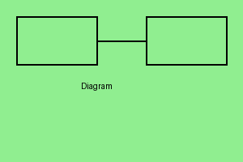
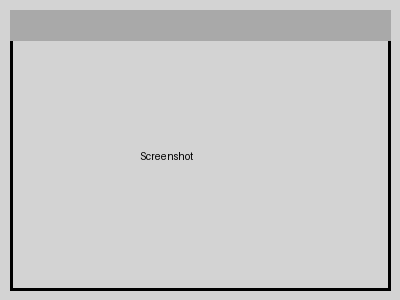

# Example Markdown Document

This document demonstrates various markdown features for PDF rendering validation.

## Тестування Українською

Це тестовий текст українською мовою для перевірки підтримки Unicode/UTF-8.

**Важливо:** всі літери мають правильно відображатися в PDF.

### Приклад коду з коментарями

```python
# Функція для обчислення факторіалу
def factorial(n):
    """Обчислює факторіал числа n"""
    if n <= 1:
        return 1
    return n * factorial(n - 1)

# Тестування
result = factorial(5)
print(f"Факторіал 5 = {result}")
```

## Table of Contents

1. [Code Blocks](#code-blocks)
2. [Tables](#tables)
3. [Lists](#lists)
4. [Images](#images)

## Code Blocks

### Python Example

```python
def fibonacci(n):
    """Calculate Fibonacci sequence up to n terms."""
    if n <= 0:
        return []
    elif n == 1:
        return [0]
    elif n == 2:
        return [0, 1]
    
    sequence = [0, 1]
    for i in range(2, n):
        sequence.append(sequence[i-1] + sequence[i-2])
    return sequence

# Test the function
result = fibonacci(10)
print(f"First 10 Fibonacci numbers: {result}")
```

### JavaScript Example

```javascript
const calculateSum = (arr) => {
    return arr.reduce((acc, val) => acc + val, 0);
};

const numbers = [1, 2, 3, 4, 5];
console.log(`Sum: ${calculateSum(numbers)}`);
```

### Bash Script

```bash
#!/bin/bash
echo "Testing markdown to PDF conversion"
for i in {1..5}; do
    echo "Iteration $i"
done
```

## Tables

### Feature Comparison

| Feature | Pandoc | Go Implementation | Notes |
|---------|--------|-------------------|-------|
| Syntax Highlighting | Yes | Basic | Using Pygments vs simplified |
| Image Support | Full | Basic | Relative paths supported |
| Table Rendering | Full | Yes | GitHub-flavored markdown |
| File Size | 2.6 GB | ~800 MB | Significant reduction |
| Speed | Fast | Very Fast | Native Go performance |

### Pricing Table

| Plan | Price | Features | Support |
|------|-------|----------|---------|
| Free | $0 | Basic rendering | Community |
| Pro | $10/mo | Advanced features | Email |
| Enterprise | Custom | All features | 24/7 |

## Lists

### Simple List

- First item
- Second item
- Third item
- Fourth item

### Nested Lists

1. **Programming Languages**
   - Compiled Languages
     - Go
       - Fast compilation
       - Static typing
       - Excellent concurrency
     - Rust
       - Memory safety
       - Zero-cost abstractions
     - C++
       - High performance
       - Wide adoption
   - Interpreted Languages
     - Python
       - Easy to learn
       - Rich ecosystem
       - Great for data science
     - JavaScript
       - Web development
       - Node.js for backend
       - React, Vue, Angular

2. **Development Tools**
   - Version Control
     - Git
     - GitHub
     - GitLab
   - CI/CD
     - GitHub Actions
     - Jenkins
     - CircleCI
   - Containerization
     - Docker
       - Image building
       - Container orchestration
     - Kubernetes
       - Pod management
       - Service discovery

3. **Best Practices**
   - Code Review
     - Peer reviews
     - Automated checks
   - Testing
     - Unit tests
     - Integration tests
     - End-to-end tests
   - Documentation
     - README files
     - API documentation
     - User guides

### Mixed List

- Top level item
  1. Numbered sub-item
  2. Another numbered item
     - Nested bullet
     - Another bullet
       - Even deeper
  3. Back to numbered
- Another top level
  - Sub bullet
    1. Numbered within bullets
    2. Second numbered item

## Images

### Logo Example


### Diagram



### Screenshot



## Text Formatting

This paragraph contains **bold text**, *italic text*, and ***bold italic text***. You can also use `inline code` for technical terms like `docker build` or `npm install`.

Here's a line with ~~strikethrough~~ text.

## Blockquotes

> This is a blockquote. It can contain multiple paragraphs.
>
> Like this second paragraph in the quote.

> Nested quotes are also possible:
>
> > This is a nested quote
> >
> > > And this is even more nested

## Horizontal Rules

Below is a horizontal rule:

---

Above is a horizontal rule.

## Task Lists

- [x] Implement markdown parser
- [x] Add table support
- [x] Support code blocks
- [ ] Add advanced image positioning
- [ ] Implement custom themes
- [ ] Add syntax highlighting

## Conclusion

This example document demonstrates various markdown features that should be properly rendered in the PDF output. The rendering engine should handle:

- Multiple heading levels
- Code blocks with syntax highlighting
- Complex tables with alignment
- Deeply nested lists
- Images (with graceful handling of missing files)
- Various text formatting options
- Special elements like blockquotes and task lists
